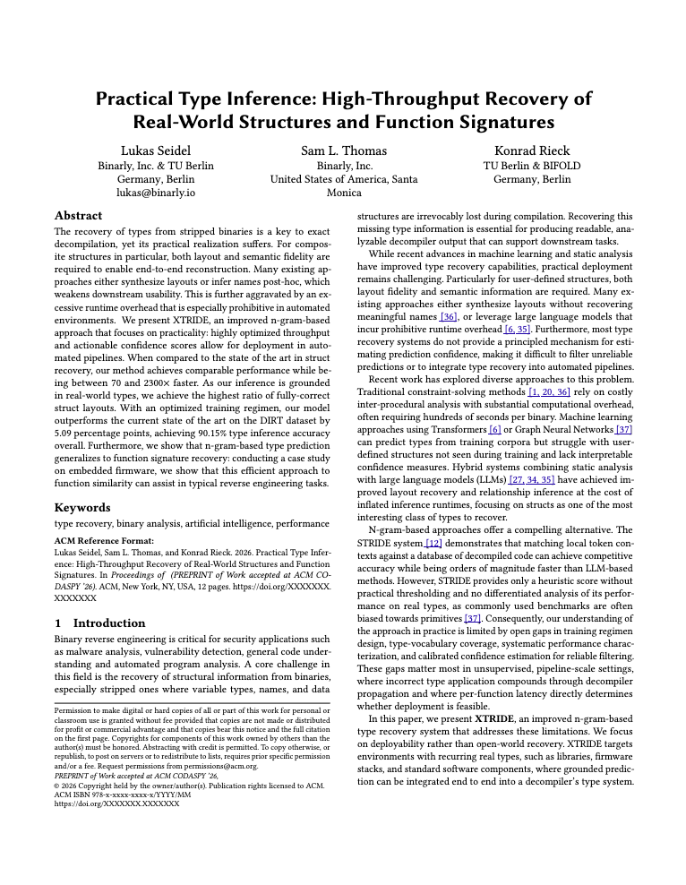

# XTRIDE: N-gram-based Practical Type Recovery

## Introduction
<a href="https://arxiv.org/pdf/2603.08225" target="_blank"> </a>
We present XTRIDE, an improved n-gram-based (cf. [STRIDE](https://arxiv.org/pdf/2407.02733)) approach on type recovery for binaries that focuses on practicality: 
highly optimized throughput and actionable confidence scores allow for deployment in automated pipelines. 
When compared to the state of the art in struct recovery, our method achieves comparable performance while being between 70 and 2300× faster.

<br />
<br />
<br />

## Build Instructions
The CLI tool in `./bin` requires a `library of version 1.8.4 or later` for hdf5 installed (as per the crate's docs).
Building with the latest version fails on MacOS, we recommend installing hdf5 v1.10, e.g., with
```
brew install hdf5@1.10
```

## How to use the CLI Tool
1. create tokenized dataset of form, see [Dataset Preparation](./data/README.md).
2. create dataset splits
    ```
    cargo run --release -- create-dataset -i ../edk2_tokens/ -o ./
    ```
3. build vocab
    ```
    cargo run --release -- build-vocab ./converted_train.jsonl type_edk2.vocab -t type
    ```
4. build ngram databases for n = {2, 4, 8, 12, 48} (specify in `bin/src/db_creation.rs`).
    ```
    cargo run --release -- build-all-dbs -t type -k 5 --flanking -o dbs_edk2/ ./converted_train.jsonl type_edk2.vocab
    ```
5. Evaluate on the test set split
    ```
    cargo run --release -- evaluate ./converted_test.jsonl type_edk2.vocab ./out_edk2.json -t type --flanking --db-dir dbs_edk2/
    ```

## Datasets
We include the preprocessed data to replicate the $XTRIDE_{PLUS}$ models described in our paper in the `./data` directory. 
The JSONL files can be directly used starting with step 3. in [How to use the CLI Tool](#how-to-use-the-cli-tool).

To extract samples from the raw DIRT corpus and prepare them for training and inference, see our [Dataset Preparation Docs](data/README.md) and use the provided hash files to replicate original test and validation datasets.