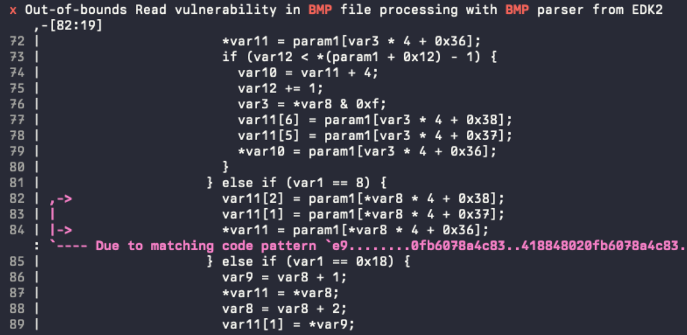
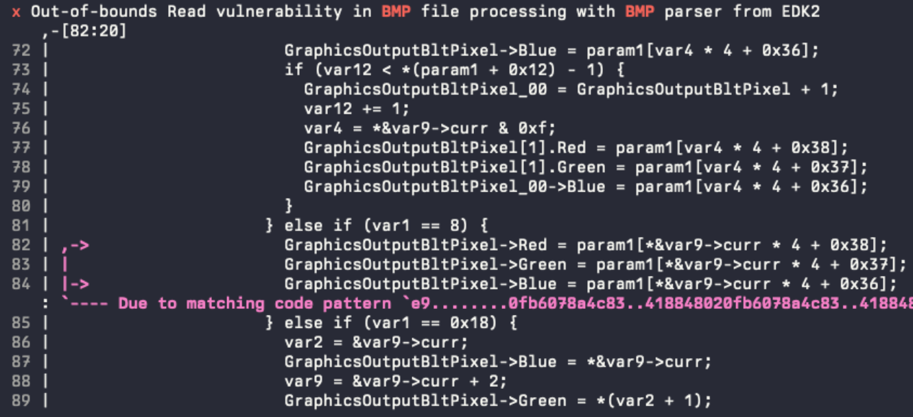

# XTRIDE: N-gram-based Practical Type Recovery

## Introduction
<a href="https://arxiv.org/pdf/2603.08225" target="_blank"> </a>
We present XTRIDE, an improved n-gram-based (cf. [STRIDE](https://arxiv.org/pdf/2407.02733)) approach on type recovery for binaries that focuses on practicality: 
highly optimized throughput and actionable confidence scores allow for deployment in automated pipelines. 
When compared to the state of the art in struct recovery, our method achieves comparable performance while being between 70 and 2300× faster.

<br />
<br />
<br />

## Build Instructions
The CLI tool in `./bin` requires a `library of version 1.8.4 or later` for hdf5 installed (as per the crate's docs).
Building with the latest version fails on MacOS, we recommend installing hdf5 v1.10, e.g., with
```
brew install hdf5@1.10
```

## How to use the CLI Tool
1. create tokenized dataset of form, see [Dataset Preparation](./data/README.md).
2. create dataset splits
    ```
    cargo run --release -- create-dataset -i ../new_dataset/ -o ./
    ```
3. build vocab
    ```
    cargo run --release -- build-vocab ./xtride_plus_train.jsonl xtride_plus.vocab -t type
    ```
4. build ngram databases for n = {2, 4, 8, 12, 48} (specify in `bin/src/db_creation.rs`).
    ```
    cargo run --release -- build-all-dbs -t type -k 5 --flanking -o xtride_plus_dbs/ ./xtride_plus_train.jsonl xtride_plus.vocab
    ```
5. Evaluate on the test set split
    ```
    cargo run --release -- evaluate --threshold-sweep ./xtride_plus_test.jsonl xtride_plus.vocab ./out_xtride.json --flanking --db-dir ./xtride_plus_dbs
    ```

## Recovery Mode
Use `recover` to run best-effort type recovery on a single decompiled function listing (plain text input).

### Input expectations
- one function per file
- decompiler-style symbol names are recommended (e.g., `var*`, `param*`, `stack*`, `iVar*`, `sub_*`)
- predictions are only as good as alignment between your input style and the training data distribution

### Basic usage example
```bash
cargo run --release -- recover ./decompiled_function.c \
    --vocab ./xtride_plus.vocab \
    --db-dir ./xtride_plus_dbs \
    --flanking \
    --top-k 5 \
```

### Optional flags
- `--fn-vocab <path>`: explicit function vocabulary path (if omitted, `recover` tries `<vocab_stem>.fn.vocab`)
- `--strip`: enable legacy full strip mode (DIRT / STRIDE backwards-compatibility, use with caution)
- `--threshold <float>`: hide predictions below score cutoff (`1.0` disables filtering)
- `--top-k <int>`: number of candidates shown per symbol (default: `5`)

### Output interpretation
The presented scores are confidence-style ranking scores from the model pipeline.
They are useful for relative ranking and filtering, not calibrated probabilities.
The summary reports detected symbols, filtered symbols, and symbols with no model output.

## Provided Models
We include the preprocessed data to replicate the $XTRIDE_{PLUS}$ models described in our paper in the `./data` directory.
The JSONL files can be directly used to extract a vocabulary and train the model (steps 3 and onwards, choose the 16-db configuration in `bin/src/db_creation.rs`).
While the training dataset includes a large amount of data from a wide variety of binaries, we want to reiterate that the generalizability of n-gram-based approaches is limited. 
We always recommend adding domain-specific samples to the dataset, depending on where you plan to employ the model.

The provided dataset contains samples that are
- stripped
- ELF binaries
- collected from Ghidra

Trying to run inference on samples that diverge from this distribution will most likely result in unusable predictions.

## Datasets
Further information on how to extract data for new datasets or to retrain and evaluate on the DIRT dataset are included in [Dataset Preparation Docs](data/README.md).

## Decompiler Integration
The `retyper` module showcases a reference implementation for a deep integration of the XTRIDE type recovery system with a decompiler.
The functionality is gated behind a feature flag and can be activate with `cargo build --features retyper`.

We make use of Binarly's BIAS framework for program analysis that was published as part of [VulHunt](https://github.com/vulhunt-re/vulhunt). The framework features an expressive typing system that integrates seamlessly with the fork of the Ghidra decompiler backend that is used to lift internally recovered representations to pseudo C. 
We extended this fork and its ffi with [interfaces that allow to directly modify variable types in the decompiler](https://github.com/vulhunt-re/vulhunt/blob/4cca2ee479cca49dc4cd68b55383821e588ac197/bias-core/cxx/decompiler.cc#L1087).
This enables direct application of inferred types within the decompiler context, incl. propagation of field types and similar.

<table>
  <tr>
    <td align="center"><b>Before:</b></td>
    <td align="center"><b>After:</b></td>
  </tr>
  <tr>
    <td></td>
    <td></td>
  </tr>
</table>

For further information and examples check out [our blog post](https://www.binarly.io/blog/type-inference-for-decompiled-code-from-hidden-semantics-to-structured-insights).

In general, any decompiler integration requires a translation layer from text-based predictions (from the vocabulary) into a tool-specific representation. 
The format used in DIRT is expressive enough to allow for this but requires recursive resolution of types (e.g., in structs) and manual computation of offsets and sizes (all necessary info is there, incl. padding annotations).
For the `retyper` module, the types in the vocab (and thus, in the training dataset) are required to be serialized [BIAS types](https://github.com/vulhunt-re/vulhunt/blob/4cca2ee479cca49dc4cd68b55383821e588ac197/bias-core/src/ir/types.rs).
We are currently not planning on publishing a full pipeline for data extraction and dataset creation and thus deem this a reference implementation rather than a full PoC.

## Citation
If you use the code, techniques or results provided with this repository and the corresponding paper, please cite our work as follows:
```
@inproceedings{Seidel_Practical_Type_Inference_2026,
    author = {Seidel, Lukas and Thomas, Sam L. and Rieck, Konrad},
    title = {{Practical Type Inference: High-Throughput Recovery of Real-World Structures and Function Signatures}},
    series = {The 16th ACM Conference on Data and Application Security and Privacy},
    month = jun,
    year = {2026},
    url = {https://arxiv.org/abs/2603.08225},
}
```